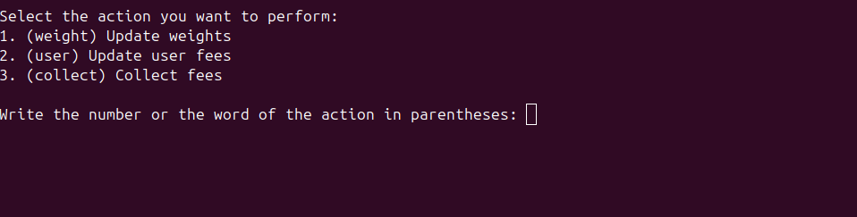

## Manager Orders

### How to sign the update fees orders

When you want to update 'weights', 'user fees' or simply 'collect' from an MTK using "My wallet" page, you will need to enter a signature and a number (valid until/valid to). These values ​​can be obtained using the `pnpm run sign-fees` command.

#### Prerequisites

If you want to update weights or user fees, you will need to have the `weights object` or `user fees object`. To get these objects, you can go to the Metera `/me` page and click on the "Copy weights as object" or "Copy fees as object" button.

Make sure to complete the fields before copying the object.

Example of a weights object:

```json
[
  {
    "asset": {
      "asset_name": "0014df1055534441",
      "policy_id": "a9fc2c980e6beed499b91089ca06ad433961a6238690219b8021fe43"
    },
    "info": {
      "num": 50n,
      "den": 100n
    }
  },
  {
    "asset": {
      "asset_name": "0014df104d4554455241",
      "policy_id": "a9fc2c980e6beed499b91089ca06ad433961a6238690219b8021fe43"
    },
    "info": {
      "num": 35n,
      "den": 100n
    }
  },
  {
    "asset": {
      "asset_name": "0014df1048554e54",
      "policy_id": "a9fc2c980e6beed499b91089ca06ad433961a6238690219b8021fe43"
    },
    "info": {
      "num": 15n,
      "den": 100n
    }
  },
  ...
]
```

Example of a user fees object:

```json
{
  "entryFee": 50n,
  "exitFee": 150n
}
```

**NOTE**: 50n means 0.5% and 150n means 1.5%. If you want to update the fee to `x%`, you will need to enter `x`\*100.

The format is not important. Just copy the object and paste it in the `input.txt` file in the `sign-fees/` folder.

#### Steps

1. Set your seed phrase in the `.env` file. See the `.env.example` file for the format. **Don't forget to rename the file to `.env`**.
2. From the root folder, run `bun run sign-fees`.
3. You will be asked to enter the action you want to perform.
   
   For example:

   - If you want to update the weights, you will need to enter `1` or `weights`.
   - If you want to update the user fees, you will need to enter `2` or `user`.
   - If you want to collect fees, you will need to enter `3` or `collect`.

4. If you complete the prerequisites, the script will return the signature and the number (valid until/valid to).
5. Copy the values and paste them in the page to complete the form.
